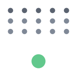
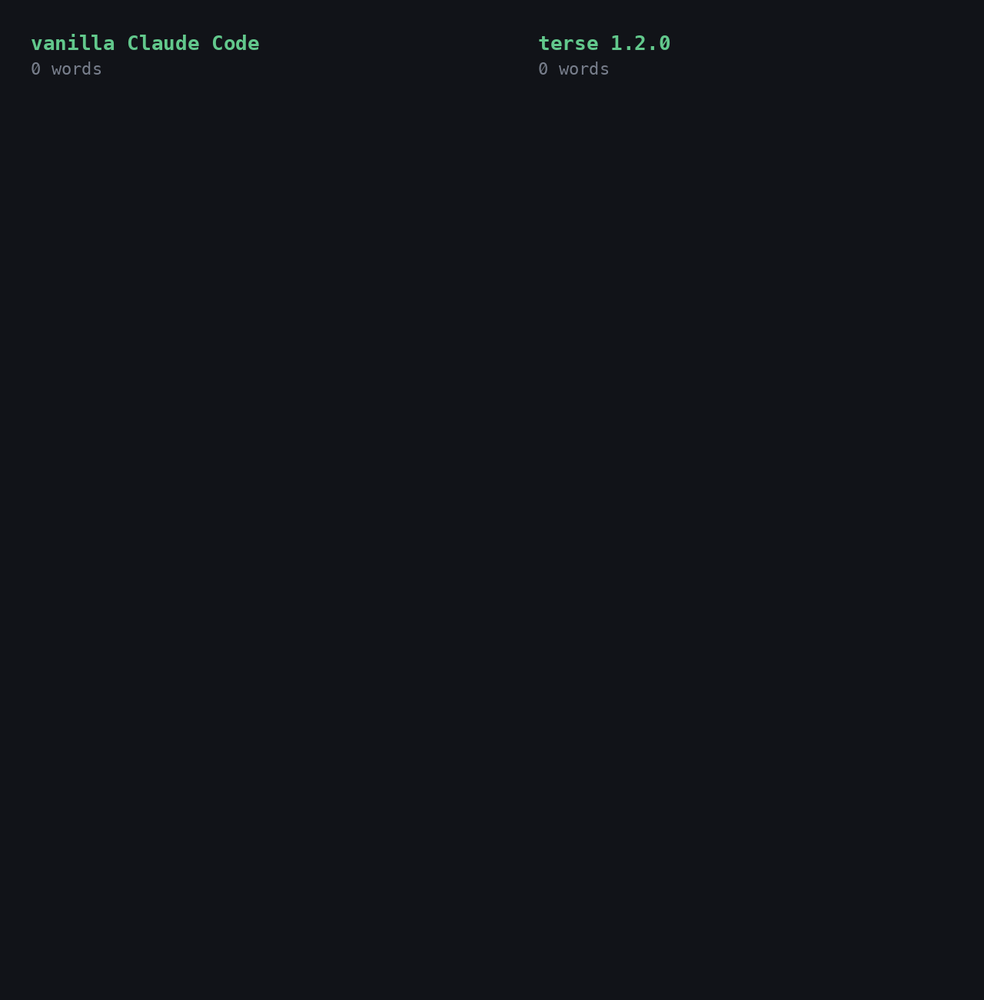

# terse - makes Claude speak normally

<div align="center">



</div>

I struggle with the way Claude Code speaks to me. Every single question comes back as an essay. Slogans, metaphors, a recap of what it just did, "it's not X, it's Y". Every. Single. Time.

Claude's own "concise" mode shortens it, somewhat, but keeps the the rest of the slop.

I tried system prompts, those got forgotten after a couple of turns. I tried looking for plugins but none consistently made Claude speak normally. Some where slash commands, other solved for token use, others solved for neurodivergence. None of them made Claude speak normally.

I just wanted to not read an essay and make Claude get to the point fast, every single time.

So I spent a few weeks nothing down every thing it did that annoyed me and what i want it say instead, and built a Plugin around that. It worked for me. If Claude speaks to you the same way, it is yours.




***The rest of this README is co-written by Claude Code using the terse plugin. I take most of the credit, but none for the words.***

A Claude Code plugin that cuts reply length in half and removes mannered prose. **Fable 5.1: 46% fewer words, 51% lower cost. Opus 5.5: 54% fewer words, 32% lower cost. [Measured](docs/benchmark.md) on 20 prompts against a real codebase.** The writing rules apply to replies, documents, commits and subagents. A context meter for the status line comes with it.

The tables use these terms.

- Vanilla is Claude Code with no CLAUDE.md, no plugins and no custom instructions.
- A style violation is a sentence that breaks one of the rules. An Opus 5 judge counts them by reading each reply against the rule list. Counts are per 1,000 words, so long and short replies compare.
- Metaphor is figurative wording where a literal phrase exists. "A 3,000-line merge gets a skim and a prayer" in place of "a 3,000-line merge gets a 10-minute read and no line-by-line review".
- An "X, not Y" reframe is a contrast used as a label in place of an explanation. "This is intent, not behavior" in place of "the docstring says X, the code does Y".
- A slogan is a short line that sounds like a principle and states no mechanism. "The decision is the feature."
- Cadence is rhythm built for effect, such as triads and punchline endings.
- Bloat is a sentence that adds no fact, including narration like "I'll look at the code now".
- First person is "I", "me", "my", "let me" and their contractions. Sentences whose subject is the writer.
- Output tokens are what the model wrote, thinking included. Output tokens are priced about five times higher than input tokens on Opus and Fable.

Measured on 12 public prompts, vanilla Claude Code against terse 1.1.0. Opus 5.5, effort high, one run each.

| | vanilla | terse | change |
|---|---|---|---|
| Words, 10 chat replies | 5,959 | 1,793 | -70% |
| Median reply | 636 words | 181 words | -72% |
| Output tokens, 12 runs | 19,310 | 10,528 | -45% |
| Style violations per 1k words (Opus judge) | 11.1 | 1.1 | -90% |
| First person per 1k | 2.79 | 0.47 | -83% |
| "X, not Y" reframes per 1k | 0.84 | 0.56 | -33% |
| Slogans per 1k | 1.17 | 0.0 | -100% |
| Metaphor per 1k | 3.69 | 0.0 | -100% |

Tables for Fable 5.1, for Opus 5.5 at effort medium, and for the 1.0.0 rule text: [docs/models](docs/models/README.md). Method, prompts and the judge rubric: [docs/benchmark.md](docs/benchmark.md).

## Install

From the Claude directory: open [the terse listing](https://claude.ai/customize/plugins/id/aa4422b4-a8c3-42e2-8f4f-d505301cb4bd@anthropic-plugin-directory) and select **Add to Claude Code**. The plugin is saved to your claude.ai account and downloads the next time you start Claude Code signed in to that account. In a running session, `/reload-plugins` loads it at once. Anthropic scans and reviews each version before the directory serves it.

From GitHub, in Claude Code:

```
/plugin marketplace add lowenbjer/claude-terse
/plugin install terse@terse
```

Both routes install the same files. The writing rules apply to every new session, after `/clear`, and to an existing session you exit and resume with `claude --resume`.

For the context meter, run `/terse:install-meter` once. It copies the 26-line meter script to the plugin's data directory, which plugin updates leave in place, and adds one `statusLine` entry to your `~/.claude/settings.json`. The entry takes effect on save.

## What you get

The rules are a reply shape, 22 rules and 18 before/after pairs, 877 words. The shape: one sentence with the answer, then a list or a table, then at most one caveat sentence, then stop. Every sentence has the topic as its subject: no "I", no account of what was checked or would be done. Bullets start with the fact, so no bold lead-ins and no label lines. Plain words in place of coined names. No em dashes, no slogans, no "X, not Y" framing, no self-labeling, no closing offers. Chat replies stop at 150 words unless you ask for a document or a walkthrough. A findings list gets one or two sentences per finding. A redo sends only the delta. Where a rule has a positive form, the text states the form ("The last sentence is a fact.") ahead of the ban. Full text: [rules/RULES.md](rules/RULES.md).

The rules ship as an output style. It applies while the plugin is enabled and is part of the main agent's system prompt. Subagents run their own system prompt, so a `SubagentStart` hook hands them the same text. No hook rewrites or blocks anything.

The reminder exists because the output style is the first part of the context. After 20 or 30 turns it is 100k tokens before the current prompt. The model's own recent replies become its nearest style examples. From there the replies show the answer in the last line, "I checked" sentences, dashes, "X, not Y" and slogans. A `UserPromptSubmit` hook adds the whole rule set, condensed to 576 characters, to every prompt next to your text. Cost per turn is about 145 input tokens. The text is [rules/REMINDER.md](rules/REMINDER.md).

The meter shows model name and context fill as a percentage. Green below 37%, yellow from 37%, orange from 49%, skull from 60%. The thresholds are set below the usual 50, 65 and 80 percent. Three studies show retrieval quality dropping well before a large window fills:

- Chroma's [Context Rot](https://www.trychroma.com/research/context-rot) report: 18 models, degradation from 50k tokens on a 200k window.
- [NoLiMa](https://arxiv.org/abs/2502.05167): 11 of 13 models at half their baseline by 32k tokens.
- [Lost in the Middle](https://arxiv.org/abs/2307.03172): content in the middle of a long context gets less attention than the start and end.

The thresholds are the three numbers near the top of [statusline/context-meter.js](statusline/context-meter.js).

## Before and after

Prompt, run on Opus 5.5 with each setup: "We have a Flask API with a Postgres database. Requests time out under load once a day around 09:00. Where would you look first and why?"

**Vanilla, 636 words:**

> # Where I'd look first for the 09:00 timeouts
>
> The 09:00 timing is the most useful clue. Before looking at any code, find out which of these two things is happening:
>
> 1. **Traffic goes up at 09:00.** The start of the workday brings logins, dashboards and syncs. That's a capacity problem.
> 2. **Traffic stays flat but something else runs at 09:00.** That's contention from a scheduled job.
>
> Compare your request-rate graph at 09:00 with other hours. That one check tells you which half of the problem you're in.
>
> ## 1. Check what runs at 09:00
>
> Look at crontabs, `pg_cron`, Celery beat, Kubernetes CronJobs, backups (`pg_dump`), ETL and report jobs, and `REFRESH MATERIALIZED VIEW`. Also check for cache entries that all expire at the same moment, because that sends every request to the database at once.
>
> Be careful with timezones. 09:00 local might be 07:00 UTC in the scheduler config, so grep for both.
>
> Common problems:
> - A `REFRESH MATERIALIZED VIEW` without `CONCURRENTLY`, a bulk `UPDATE`, or a migration. Each of these takes locks that API queries then wait behind.
> - A backup or batch job using up disk I/O.
>
> ## 2. Capture what Postgres is doing during the window
>
> This gives you the fastest real answer. Snapshot `pg_stat_activity` every 10–15 seconds from 08:55 to 09:15:
>
> ```sql
> SELECT now(), state, wait_event_type, wait_event,
>        now() - xact_start AS xact_age, left(query, 120) AS query, application_name
> FROM pg_stat_activity
> WHERE datname = current_database()
> ORDER BY xact_start NULLS LAST;
> ```
>
> Read the results like this:
> - **Lots of `wait_event_type = 'Lock'`:** something is holding locks. Join with `pg_locks` (or use `pg_blocking_pids()`) to find the blocking session. It's usually the scheduled job from step 1.
> - **Lots of `idle in transaction`:** the app opens transactions and doesn't close them quickly. That holds connections and locks.
> - **Many `active` sessions running the same query:** one query is slow at scale, often a missing index or a stale plan. Check `pg_stat_statements` for that window.
> - **Session count close to `max_connections`:** you're running out of connections (see step 3).
>
> Also set `log_min_duration_statement` (e.g. 500ms) and `log_lock_waits = on` so the next occurrence leaves a record.
>
> ## 3. Check for app-side connection pool exhaustion
>
> This is the most common cause of timeouts in Flask + SQLAlchemy apps. Search the app logs around 09:00 for:
>
> ```
> QueuePool limit of size 5 overflow 10 reached, connection timed out
> ```
>
> Then do the arithmetic: gunicorn workers × threads × (`pool_size` + `max_overflow`) × number of instances, compared with Postgres `max_connections`. When traffic jumps, requests queue for a pooled connection until they time out. Postgres can look almost idle while this happens.
>
> Also check for sessions that aren't returned to the pool. The usual causes are a missing `db.session.remove()` or teardown handler, or slow external HTTP calls made inside a transaction.
>
> ## 4. Find out which timeout is firing
>
> The load balancer (often 60s), gunicorn `--timeout` (30s by default) and SQLAlchemy `pool_timeout` (30s by default) each point to a different place:
> - Gunicorn `WORKER TIMEOUT` messages mean the workers are blocked. They're either waiting on the database or there are too few sync workers.
> - A 504 from the load balancer with no gunicorn error means requests are queuing before they reach a worker.
>
> ## My recommendation
>
> Run the `pg_stat_activity` snapshot loop at tomorrow's 09:00. At the same time, grep the app logs for the pool error and list every scheduled job near 09:00. That will very likely narrow it to one of two causes: a job holding locks, or pool exhaustion under the morning traffic. The fix is very different for each: move or rewrite the job, or resize the pool and add a connection pooler such as PgBouncer.
>
> If you share the scheduler config, the SQLAlchemy engine settings and the gunicorn command, I can check the connection arithmetic for you.

**terse 1.2.0, 180 words:**

> Start with what runs at 09:00, since a fixed daily time points to a scheduled job or a login surge, not random load.
>
> - Check pg_stat_activity from 08:55 to 09:15. Long queries, "idle in transaction" sessions, or lock waits show which side blocks.
> - List cron jobs, Celery beat tasks, pg_cron entries and backups scheduled near 09:00. A report, ETL or pg_dump can hold locks or saturate disk I/O.
> - Compare Gunicorn workers times threads with SQLAlchemy pool_size plus max_overflow. Requests beyond that queue for pool_timeout (30 s default), which looks like a timeout.
> - Compare Postgres max_connections with the total across all app instances. Exhausting it rejects new connections outright.
> - Turn on log_min_duration_statement (for example 500 ms) and log_lock_waits. The next 09:00 run then records the slow statements and their blockers.
> - Check autovacuum and ANALYZE timing on the busiest tables. Stale statistics after a nightly bulk load can switch plans to sequential scans.
>
> The two logging settings are cheap to turn on today, and they separate a database-side cause from an app-side pool limit after one morning.

Both replies name scheduled jobs, lock waits and pool exhaustion. The vanilla one adds six headers, a recommendation section that repeats steps 1 to 3, and an offer to check the config. The terse one gives the pool arithmetic, the sampling window and the two log settings, with no sentence about the writer. The 1.2.0 text ran this prompt four times: 148, 176, 180 and 189 words. Two of the four opened bullets with bold lead-ins against rule 21. The 180-word run is shown.

## Measured limits

- Opus 5.5 and Fable 5.1 are the measured main agents. Opus 5 and Sonnet 5 ran only as subagents. With the rules in context, Opus 5 kept 13 em dashes per 1k words and Sonnet put a dash in 1 reply of 5. No numbers exist for either as the main model. Per-model tables: [docs/models](docs/models/README.md).
- Metaphor drops to 0 on the public set and by half on the private set. Opus 5.5 with the 1.1.0 text: 3.69 to 0.0 per 1k on 12 public prompts, 3.09 to 1.57 on 20 private prompts. Fable 5.1 with the 1.0.0 text: 7.2 to 3.3 on the public set.
- The 150-word cap shortens replies without enforcing the limit. Chat words fell 46 to 70 percent across two prompt sets and two models. Long analysis questions still run over.
- Subagent output followed the subagent model. In a Fable 5.1 session, Explore-type subagents ran Opus 5 and kept 13 em dashes per 1k words with the rules in their context. Fable subagents produced 0.1 per 1k without any rules. In an Opus 5.5 session, the subagents ran Opus 5.5 and wrote 0.4 per 1k without the rules and 0 with them. To pick the subagent model, set `CLAUDE_CODE_SUBAGENT_MODEL` to your main model, or ask for general-purpose subagents, which inherit it.
- The reply shape and rule 21 removed the two forms they name and no others. The check was a 10-turn conversation with the same prompts on both models. Bold lead-ins went from 20 to 0 on Fable 5.1 and from 36 to 0 on Opus 5.5. Label lines went from 10 to 4 and from 8 to 0. Judge-counted metaphor, cadence and bloat stayed level. Reply length stayed level. Table in [docs/benchmark.md](docs/benchmark.md#multi-turn-check). The 1.2.0 text has no public-set rerun. The tables above are the 1.1.0 text.
- Cost fell less than words. Output tokens fell 42 to 55 percent. Context tokens are most of the cost per call. Total cost fell 2 percent on the short public set with the 1.1.0 text and 9 to 12 percent with the 1.0.0 text. The reminder adds about 100 uncached tokens per turn. Thinking rose from 2,150 tokens over 12 runs with the 1.0.0 text to 4,155 with 1.1.0. On 20 chat prompts against a real codebase with a large CLAUDE.md, cost fell 51 percent on Fable 5.1 with the 1.0.0 text. On Opus 5.5 with the 1.1.0 text it fell 32 percent.

## Add your model

The catalog in [docs/models](docs/models/README.md) has one file per model. A row costs about $1 and one pull request: run the 12 public prompts with and without the plugin through `bench/run.py`, paste the two summaries, write 2 to 5 findings. Steps in [docs/models/CONTRIBUTING.md](docs/models/CONTRIBUTING.md). A reply that broke the rules goes in an issue with the "Post your worst reply" template.

## Data

The plugin makes no network calls and collects nothing. Its hooks read a text file inside the plugin directory and hand it to Claude Code. The install skill writes one key to your settings file. Details in [docs/privacy.md](docs/privacy.md).

## Uninstall

Installed from the directory: open the plugin under **Customize > Plugins** on claude.ai and select **Remove** from its menu.

Installed from GitHub:

```
/plugin uninstall terse@terse
```

Remove the `statusLine` entry from `~/.claude/settings.json` if you installed the meter. The uninstall deletes the plugin's data directory, where the meter copy lives.

## License

MIT.
